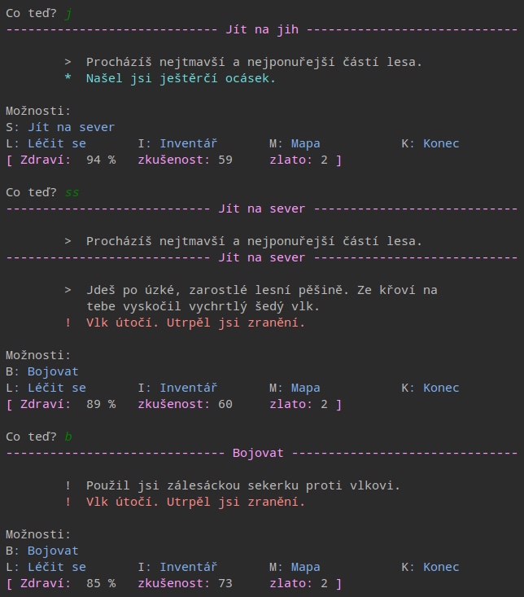
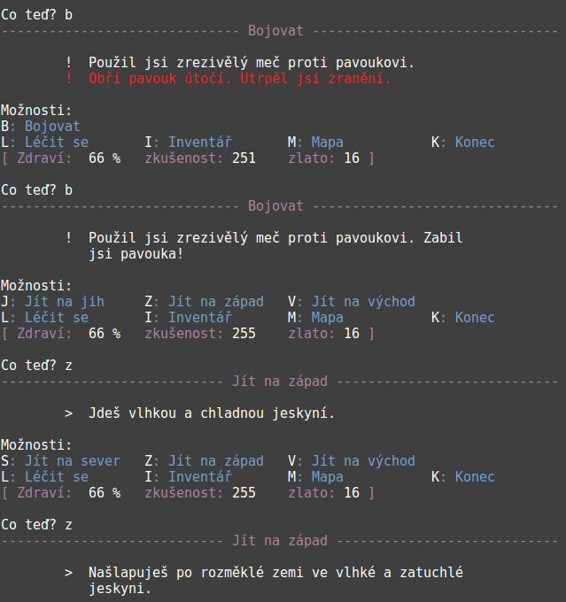
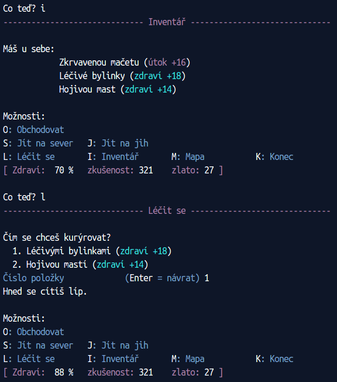

Strach ze tmy
=============

Česká textová dobrodružná hra, původně vycházející ze `vzorové hry <https://github.com/myrmica-habilis/cave-terror>`__ vytvořené podle knihy `Make Your Own Python Text Adventure <https://www.apress.com/gp/book/9781484232309>`__. Postupně upravována, rozšiřována a přeložena do češtiny, a to včetně zdrojového kódu.

Ukázky:

