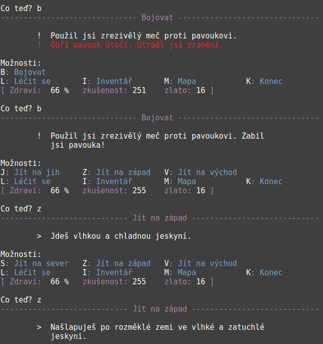
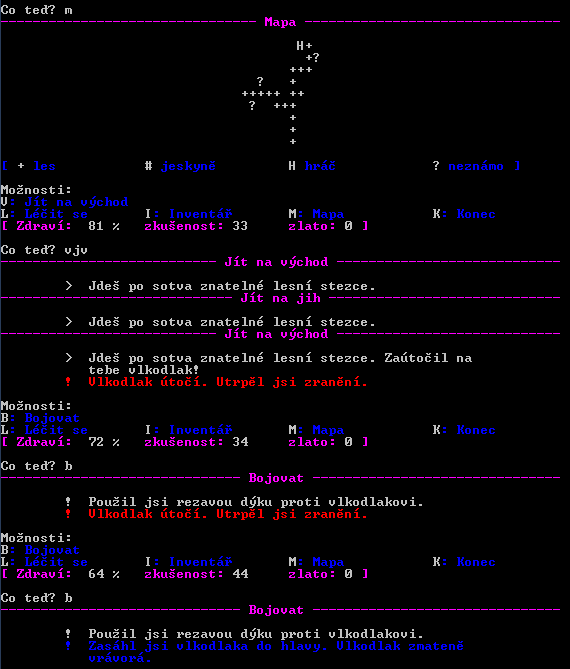
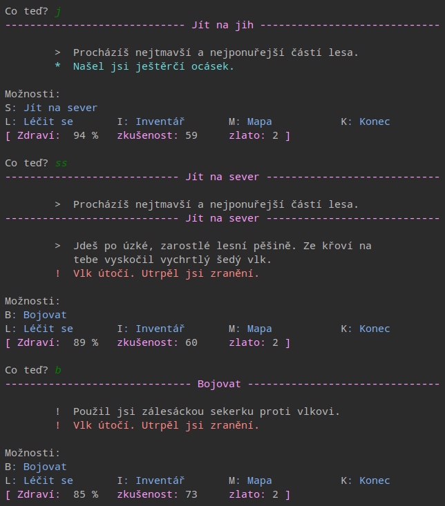
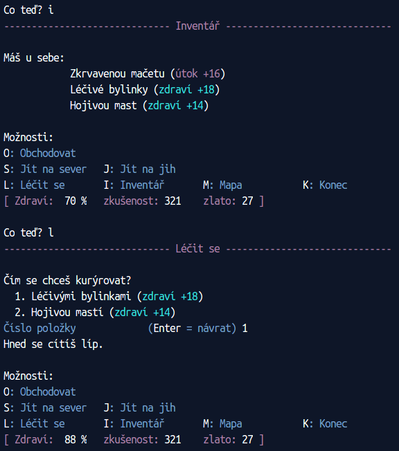

|run on repl.it|_

.. |run on repl.it| image:: https://repl.it/badge/github/myrmica-habilis/SzT
.. _run on repl.it: https://szt.myrmica.repl.run/

=============
Strach ze tmy
=============

Česká textová dobrodružná hra, původně vycházející ze `vzorové hry <https://github.com/myrmica-habilis/cave-terror>`__ vytvořené podle knihy `Make Your Own Python Text Adventure <https://www.apress.com/gp/book/9781484232309>`__. Postupně upravována, rozšiřována a přeložena do češtiny.

Instalace a spuštění
====================

Ve Windows lze použít zkompilovaný spustitelný soubor, ke stažení `zde <https://github.com/myrmica-habilis/SzT/releases/download/v1.1/SzT_v1.1.exe>`__.

Kromě toho lze hru spustit ze zdrojových souborů uložených v tomto repozitáři, pokud máte na svém systému nainstalovaný Python a Git. (poznámka: hra vyžaduje Python 3.6.1 nebo vyšší)

V libovolné složce, do níž máte oprávnění zapisovat, si naklonujte tento repozitář příkazem:

``git clone https://github.com/myrmica-habilis/SzT.git``

a přepněte se do hlavní složky projektu:

``cd SzT``

Hra vyžaduje instalaci jedné externí knihovny, proto doporučuji nejdříve vytvořit virtuální prostředí příkazem:

``python3 -m venv .env``

Ve virtuálním prostředí je vhodné nejdříve aktualizovat správce balíčků na nejnovější verzi:

``.env/bin/python -m pip install --upgrade pip setuptools``

Následně nainstalujte knihovnu `rich <https://rich.readthedocs.io>`__, která slouží k barevnému zvýraznění textů ve hře:

``.env/bin/python -m pip install rich``

Pak už můžete hru spustit příkazem:

``.env/bin/python -m szt``

Můžete při tom navíc použít tyto parametry:

``-T`` pro nastavení tmavších barev

``-B`` pro režim obyčejného textu bez barev

``-R`` pro rychlý výpis textu bez efektu plynulého rolování

Například:

``.env/bin/python -m szt -T -R``

(poznámka: ve Windows se adresářová struktura virtuálního prostředí liší, proto místo ``.env/bin/python`` používejte ``.env/Scripts/python``)

Základní informace
==================

Automatické mapování
--------------------

Po příchodu na první křižovatku (tedy záhy po započetí hry) si vaše postava začne sama kreslit mapu, kterou si můžete kdykoliv zobrazit příkazem ``M``. Tato mapa ale slouží jen k základní orientaci a neobsahuje informace o umístění nepřátel, předmětů apod.

Režim rychlé chůze
------------------
Po lokacích, které jste už navštívili, se můžete pohybovat na libovolnou vzdálenost zrychleně. Jestliže např. vaše mapa vypadá takto:

.. code-block::

         ?
       ++H
       +
    ?+ ++
     +++
       +
       +
       +

a vy se chcete vydat na neprozkoumané místo na západě, přemístíte se tam jediným příkazem ``zzjjjzzsz``. (poznámka: pokud po cestě narazíte na živého nepřítele, režim zrychleného přesunu se přeruší a nepřítel na vás normálně zaútočí)

Útěk z boje
-----------

Vaší postavě se někdy podaří v průběhu boje nepřítele omráčit a na jedno kolo vyřadit. V takové situaci je možné z lokace odejít a pokračovat dál v cestě.

Léčení
------

Léčivé prostředky (lektvary, bylinky atd.) vaší postavě mohou vylepšit zdraví maximálně na úroveň 100 %, a to i v případě, kdy jejich léčivá síla je vyšší, než kolik vám do plného zdraví zbývá. Výjimkou je nejsilnější elixír, který má zázračnou moc zlepšit zdraví i nad 100 %.

Ukázky
======

Linux Mint 18 – terminál
------------------------

Windows 7 – příkazová řádka
---------------------------

PyCharm
-------

repl.it
-------

